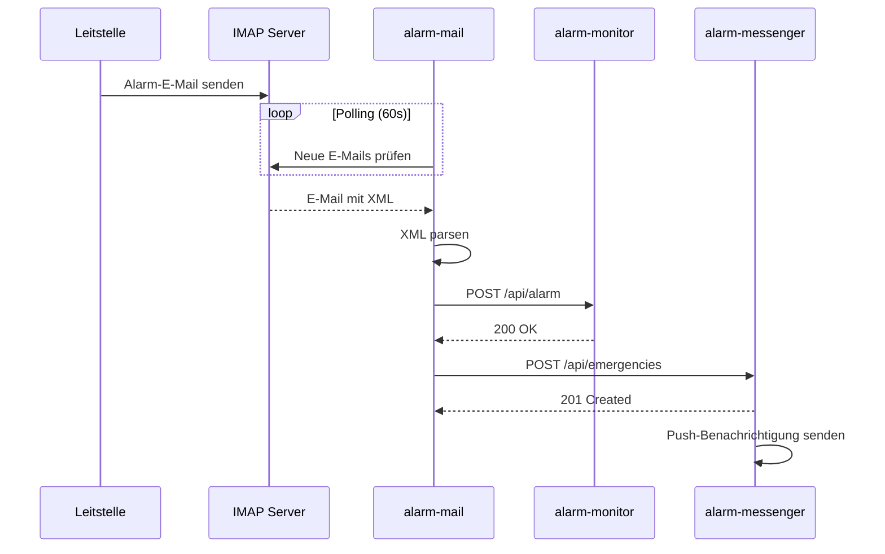
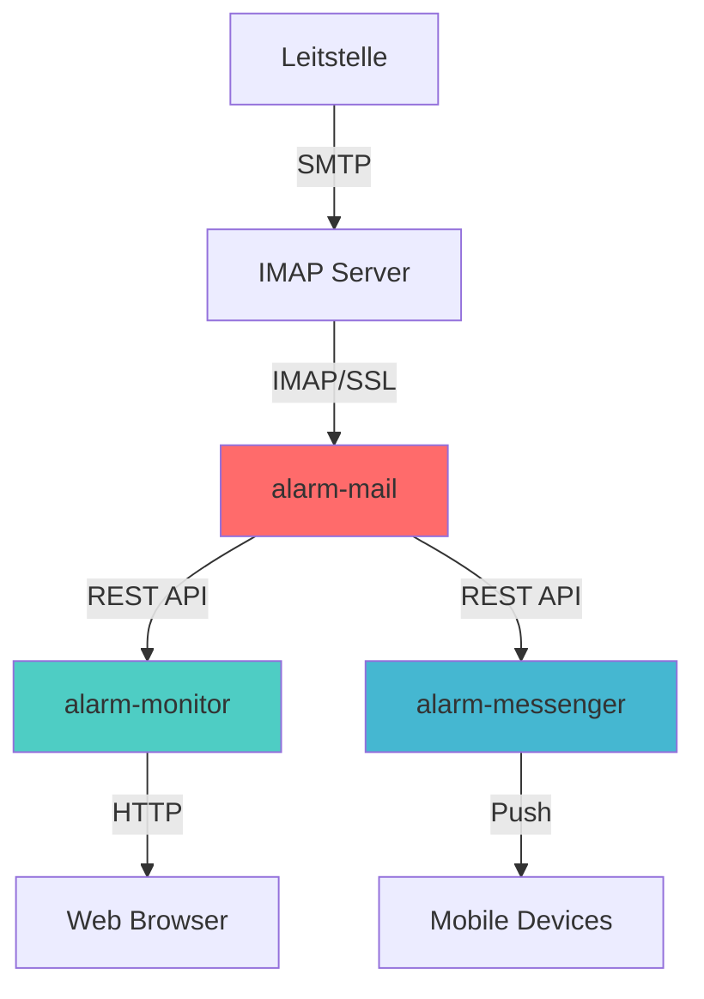

# Screenshots & Diagramme

Dieser Ordner enthält Screenshots, Diagramme und andere visuelle Dokumentation für das alarm-mail Projekt.

## Geplante Screenshots

Folgende Screenshots sollten noch erstellt und hinzugefügt werden:

### System-Übersicht
- [ ] `architecture-overview.png` - Vollständiges Architektur-Diagramm mit allen drei Services
- [ ] `data-flow.png` - Detaillierter Datenfluss von E-Mail bis Push

### Installation & Setup
- [ ] `docker-compose-setup.png` - Docker Compose Setup-Prozess
- [ ] `service-running.png` - Laufender Service mit Logs
- [ ] `health-check.png` - Health-Check-Endpunkt im Browser

### Konfiguration
- [ ] `env-example.png` - Beispiel .env-Datei mit Annotationen
- [ ] `systemd-setup.png` - Systemd-Service-Konfiguration

### E-Mail-Verarbeitung
- [ ] `email-inbox.png` - Beispiel-Alarm-E-Mail im Postfach
- [ ] `xml-structure.png` - XML-Struktur einer Alarm-E-Mail
- [ ] `parsing-logs.png` - Logs beim Parsen einer E-Mail

### Integration
- [ ] `alarm-monitor-integration.png` - Alarm im alarm-monitor Dashboard
- [ ] `alarm-messenger-notification.png` - Push-Benachrichtigung auf Mobile-Device
- [ ] `both-targets.png` - Logs bei Push zu beiden Targets

### Monitoring
- [ ] `logs-overview.png` - Strukturierte Logs des Service
- [ ] `health-monitoring.png` - Health-Check in Monitoring-System
- [ ] `error-handling.png` - Fehlerbehandlung in Logs

### Deployment-Szenarien
- [ ] `single-server.png` - All-in-One Deployment
- [ ] `distributed.png` - Verteiltes Setup auf mehreren Servern
- [ ] `kubernetes.png` - Kubernetes Deployment

## Richtlinien für Screenshots

### Format
- **Dateiformat:** PNG (für Screenshots und Diagramme)
- **Benennung:** Kleinbuchstaben, Bindestriche (z.B. `alarm-monitor-integration.png`)
- **Maximale Größe:** 2 MB pro Bild

### Qualität
- **Auflösung:** Mindestens 1920x1080 für Desktop-Screenshots
- **DPI:** 96 DPI für Web-Anzeige
- **Kompression:** Optimiert aber mit guter Qualität

### Inhalt
- **Sprache:** Deutsch (passend zur Dokumentation)
- **Anonymisierung:** Keine echten Einsatzdaten, Passwörter oder API-Keys
- **Beispieldaten:** Realistische aber fiktive Daten verwenden
- **Konsistenz:** Gleiche Beispieldaten in allen Screenshots

### Annotationen
- **Markierungen:** Rote Pfeile oder Kreise für wichtige Bereiche
- **Text:** Beschriftungen in Deutsch
- **Tool:** Empfohlen: [Greenshot](https://getgreenshot.org/), [Flameshot](https://flameshot.org/)

## Beispieldaten für Screenshots

Verwenden Sie folgende fiktive Daten für konsistente Screenshots:

### Einsatz-Beispieldaten
```
Einsatznummer: 2024-12-001
Datum: 08.12.2024 14:30:00
Stichwort: F3Y - Personen in Gefahr
Diagnose: Brand in Wohngebäude
Ort: Musterstraße 123, 12345 Musterstadt
Koordinaten: 51.2345, 9.8765
Einheiten: LF Musterstadt 1, DLK Musterstadt
TME-Codes: MUS11, MUS05
```

### Konfiguration-Beispieldaten
```
IMAP-Host: imap.beispiel-feuerwehr.de
IMAP-User: alarm@beispiel-feuerwehr.de
IMAP-Password: ***************
API-Keys: ******************************** (verdeckt anzeigen)
```

## Diagramme erstellen

### Tools
- **Architektur-Diagramme:** [draw.io](https://app.diagrams.net/), [Mermaid](https://mermaid.js.org/)
- **Flussdiagramme:** [Lucidchart](https://www.lucidchart.com/), [PlantUML](https://plantuml.com/)
- **Sequenzdiagramme:** [Mermaid](https://mermaid.js.org/), [SequenceDiagram.org](https://sequencediagram.org/)

### Stil
- **Farben:** Konsistent mit Projekt-Theme
- **Schrift:** Sans-Serif, lesbar
- **Icons:** Fire Fighter, Email, Server, Database
- **Pfeile:** Klare Richtungsangaben mit Labels

## Mermaid-Diagramme

Diagramme können direkt in Markdown mit Mermaid erstellt werden:

### Beispiel: Datenfluss


### Beispiel: Architektur


## Beitragen

Sie möchten Screenshots oder Diagramme beitragen?

1. Erstellen Sie Screenshots nach den Richtlinien
2. Speichern Sie sie in diesem Ordner
3. Aktualisieren Sie die Checkliste oben
4. Erstellen Sie einen Pull Request
5. Referenzieren Sie die Bilder in der Dokumentation

### Referenzierung in Markdown

Von der Root-Ebene (README.md):
```markdown

```

Von docs/ Verzeichnis (docs/API.md):
```markdown

```

## Lizenz

Alle Screenshots und Diagramme in diesem Ordner unterliegen der gleichen MIT-Lizenz wie das Projekt.

---

**Stand:** Dezember 2024  
**Kontakt:** GitHub Issues für Fragen
